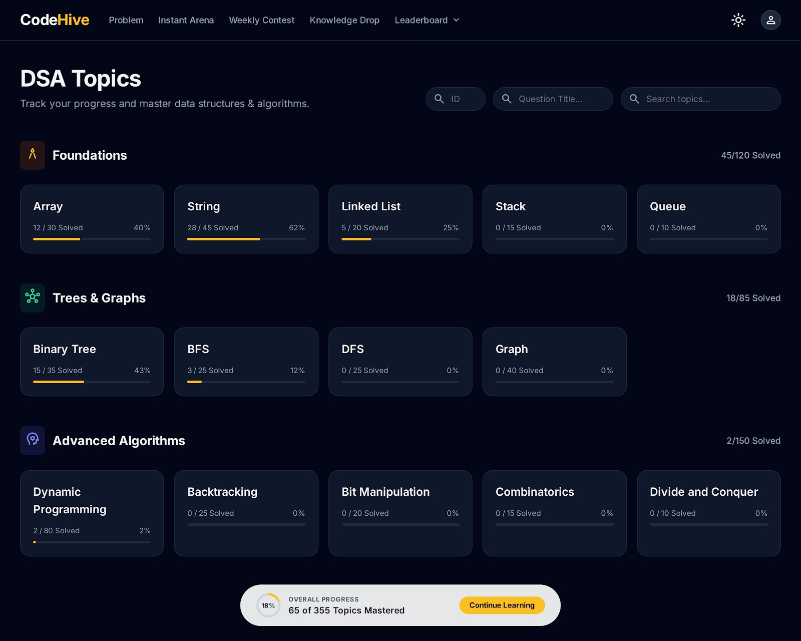

# CodeHive 🐝 [🔗 Click here for Live Demo](https://code-hive-iota.vercel.app) | [📄 Read Our Research Paper](https://researchpaper-three.vercel.app/)

**The Ultimate Competitive Programming & Coding Platform**

CodeHive is a modern, feature-rich coding platform designed to help developers master data structures and algorithms, compete in contests, and showcase their skills to the world.

> 📚 **Interested in the architecture and research behind CodeHive?** Check out our dedicated [Research Paper Website](https://researchpaper-three.vercel.app/) to read and download the full paper.

---

## 🚀 Key Features

### 🧠 Knowledge Drop
Share your coding insights and articles with the community. (New: Now featuring author profile pictures!).

  

### ⚔️ Instant Arena 
Instant Arena lets you create custom coding contests tailored to specific topics, difficulty levels, and target companies. Whether you’re preparing for product-based interviews, sharpening your data structures skills, or testing yourself under timed conditions, Instant Arena gives you full control. You can design challenges around real interview patterns, focus on weak areas, and compete in a distraction-free environment. Each contest is structured to simulate real-world coding assessments, helping you build confidence and speed. With personalized problem sets and a competitive setup, Instant Arena transforms practice into a powerful, focused, and engaging learning experience that pushes you to perform at your best.

  

### 🧩 Extensive Problem Library

Explore a comprehensive library of coding problems carefully categorized by topic and difficulty level to support learners at every stage. Practice seamlessly using a powerful Monaco-based code editor that delivers a smooth, professional coding experience. The platform supports five major programming languages—C, C++, Python, Java, and JavaScript—allowing you to code in your preferred language. Whether you’re strengthening fundamentals or preparing for interviews, this rich problem set and flexible editor help you learn, practice, and improve efficiently.

  

  
  

### 🏆 Global & Local Leaderboards
Track your progress against the community.
*   **CodeHive Rank**: Based on your activity within the platform.
*   **Global Rank**: we allow you to sync your ratings from LeetCode, CodeForces, and other platforms to generate a Universal Score!

  
  

### 🔗 Platform Verification
Verify your profiles from other coding platforms (LeetCode, CodeForces, etc.) to unify your stats on the Global Leaderboard.

  

### 👤 Detailed User Profiles
Showcase your achievements, badges, and activity graph.
*   **View Tracking**: See how many people visit your profile.
*   **Privacy Controls**: Toggle your profile visibility between Public and Private.
*   **Badges**: Earn badges for streaks and milestones (50 Days, 100 Days, etc.).

  

### 📅 Weekly Contests
Participate in scheduled contests to test your skills under pressure and climb the rankings.

  

### 🤖 AI-Driven Feedback
Get personalized, AI-powered feedback on your performance in Instant Arena and Weekly Contests. Understand your weak points, receive optimization tips, and improve your code quality instantly.

  

### 🛡️ Admin Dashboard & Management
Comprehensive tools for administrators to manage problems, contests, and users.

  

  

<!-- 

  

  

 -->

---

## 🛠️ Tech Stack & Documentation

### Frontend
*   **[React](https://react.dev/)** (v18) - Component-based UI library.
*   **[Vite](https://vitejs.dev/)** - Next-generation frontend tooling.
*   **[Tailwind CSS](https://tailwindcss.com/)** - Utility-first CSS framework.
*   **[Monaco Editor](https://github.com/suren-atoyan/monaco-react)** - The code editor that powers VS Code.
*   **[Lucide React](https://lucide.dev/)** - Beautiful, consistent icons.
*   **[React Router](https://reactrouter.com/)** - Declarative routing.

### Backend
*   **[Node.js](https://nodejs.org/)** - JavaScript runtime environment.
*   **[Express.js](https://expressjs.com/)** - Web application framework.
*   **[PostgreSQL](https://www.postgresql.org/)** - Relational database.
*   **[Passport.js](https://www.passportjs.org/)** - Authentication middleware.
*   **[Socket.io](https://socket.io/)** - Real-time bidirectional communication.
*   **[Docker](https://docs.docker.com/)** - Containerization for secure code execution.
*   **[Brevo](https://developers.brevo.com/)** - Email API for transactional emails.
---

## 📄 License

Copyright (c) 2026 Kishan Roy. All rights reserved.

This project is proprietary. Unauthorized copying, modification, distribution, or use of this software, via any medium, is strictly prohibited. For more details, see the [LICENSE](LICENSE) file.

